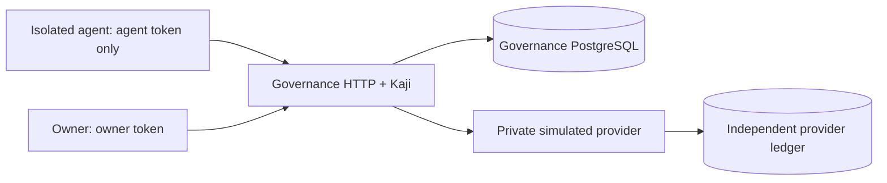

# Cankan: simulated agent action governance

First reviewable increment only: foundation, authenticated action intake, and governed simulated execution (stages 0–2). The attachment contained the requirements but no separate numbered build brief, so this scope follows its explicit implementation list. No real payments, emails, Jev calls, MCP, dashboard, approval system, assessment service, or recovery worker.

The agent submits `payments.purchase` with a task, quote, and stable operation ID. Trusted code resolves immutable quotes from a private simulator, saves canonical inputs, and uses Kaji to dispatch permitted purchases. Currency is **SIM_CENTS**, with no monetary value. A purchase including fees costs at most **500**; all authorized agents share each task's **2,000** limit. Reservations include completed payments and unresolved attempts.



## Setup and demo

Requires Node >=20.20.1, npm, and Docker Compose. These commands are for a fresh local simulator; `.secrets/` and database volumes persist across runs.

```sh
npm ci
npm run build
node dist/scripts/setup-secrets.js
docker compose up -d db provider-db
docker compose run --rm setup
docker compose up -d --build --wait provider api
docker compose run --rm agent
```

The final command submits a simulated purchase and checks the agent container cannot reach either database or the provider, read privileged secrets/trusted source, or access a container socket. The agent image contains only its client script. Services have no source mounts; only the API has a host port, bound to loopback. Never give the untrusted agent a shell on the host running these services: the Compose container is the intended execution boundary. The developer workspace is trusted.

Host demo (same agent identity, new operation ID):

```sh
AGENT_A_TOKEN_FILE=.secrets/agent-a-token npm run demo
```

The fixture task has four 500-cent purchases of capacity across **both** A agents. Later demo operations are denied when that budget is consumed. Both demos exit nonzero unless the purchase succeeds. Repeated fixture setup does not reset budgets, revoke controls, tokens, or existing quote expiries. Do not remove volumes unless intentionally discarding all simulator data.

Pause/resume with the owner token from a trusted terminal:

```sh
curl http://127.0.0.1:3000/owner/pause \
  -H "Authorization: Bearer $(cat .secrets/owner-a-token)" \
  -H 'Content-Type: application/json' -d '{"paused":true}'
```

Use `{"paused":false}` to resume. `/owner/revoke` accepts `{"principalId":"<agent UUID>"}` and permanently disables that credential for this increment. Owner credentials cannot submit purchases; agent credentials cannot change controls. Authenticated GET `/operations/<operationId>` returns the saved input, decision, dispatch, attempt, actual provider receipt if known, and separate Kaji outcome. Agents read their own operations; owners read their organization's operations. Other organizations receive 404.

Accepted purchase input (all additional fields, including claimed identities/prices, are rejected):

```json
{
  "operationId": "purchase-001",
  "action": "payments.purchase",
  "taskId": "aaaaaaaa-1111-4111-8111-111111111111",
  "quoteId": "quote-normal"
}
```

Fixtures include two organizations, A agents `aaaaaaaa-aaaa-4aaa-8aaa-aaaaaaaaaaa1` and `...aaa2`, one B agent, and separate owners. `quote-normal` is 500 + 0 fees; `quote-fees` is 450 + 50. Other quotes exercise excess fees, disallowed seller/currency, expiry, organization isolation, and a lost response after a committed provider charge. Fixture quotes expire 30 days after initial seeding. Tokens are random, stored only as SHA-256 hashes in the governance database; raw fixture tokens are operator-owned files.

## Tests

Use a disposable, real PostgreSQL administrator database named `cankan_test` on loopback. Tests create uniquely named databases and drop only those they create. They refuse missing/unsafe test configuration; no mock-database fallback or silent skip.

```sh
# Optional local PostgreSQL test server, separate from the private demo databases:
docker run --rm --name cankan-test-postgres \
  -e POSTGRES_HOST_AUTH_METHOD=trust -e POSTGRES_DB=cankan_test \
  -p 127.0.0.1:55432:5432 postgres:16.14-bookworm

# Another terminal:
npm run typecheck
TEST_DATABASE_URL=postgres://postgres@127.0.0.1:55432/cankan_test npm test
npm run build
```

The TypeScript tests use `tsx` with native `node:test`. They launch two independent governance processes and compare decisions, reservations, attempts, and receipts with the simulator's independent PostgreSQL ledger. A connection-resilience test terminates only the PostgreSQL backend it just opened, then verifies reconnection. Script checks also cover demo exit codes and preserving credentials during setup. See [review evidence](docs/review.md) for actual results and unexecuted checks.

For existing local PostgreSQL databases, `DATABASE_URL` and `PROVIDER_DATABASE_URL` select separate databases. Run `npm run migrate`, supply the five `AGENT_A_TOKEN`, `AGENT_A2_TOKEN`, `AGENT_B_TOKEN`, `OWNER_A_TOKEN`, `OWNER_B_TOKEN` values (or corresponding `_FILE` paths), and run `npm run fixtures`. Start `npm run provider` with `PROVIDER_DATABASE_URL`, `PROVIDER_TOKEN`, then `npm start` with `DATABASE_URL`, `PROVIDER_URL`, `PROVIDER_TOKEN`. Local entrypoints bind loopback by default. These host processes do not isolate arbitrary code running under the same host account.

## Dependencies

Exact direct versions are pinned in `package.json`; all transitive versions and integrity hashes are in `package-lock.json`.

| Dependency | Version | Purpose |
|---|---|---|
| `@irogane/kaji` | 0.3.1 | Embedded execution boundary |
| `pg` | 8.23.0 | PostgreSQL client |
| `zod` | 4.6.5 | Strict request, quote, saved-input, receipt schemas |
| `typescript` | 5.9.3 | Strict TypeScript compilation |
| `tsx` | 4.23.15 | TypeScript runner for native Node tests/scripts |
| `@types/node` | 20.19.43 | Node types |
| `@types/pg` | 8.23.1 | PostgreSQL client types |

Kaji's published [0.3.1 API](https://github.com/enkyuan/kaji/blob/v0.3.1/docs/api.md), [store interface](https://github.com/enkyuan/kaji/blob/v0.3.1/packages/ts/src/store/store.ts), npm README, installed `dist/index.d.mts`, and runtime source were inspected. Published 0.3.1 accepts a `.parse()` validator; current upstream documentation describes a later Standard Schema interface. This implementation typechecks against the installed package. Kaji supplies neither our authentication/policy nor a database, approval UI, or recovery engine. Its license is FSL-1.1-ALv2; see the installed package license.

See [transaction boundaries and crash gaps](docs/architecture.md) for the execution protocol and unresolved-state rules.
