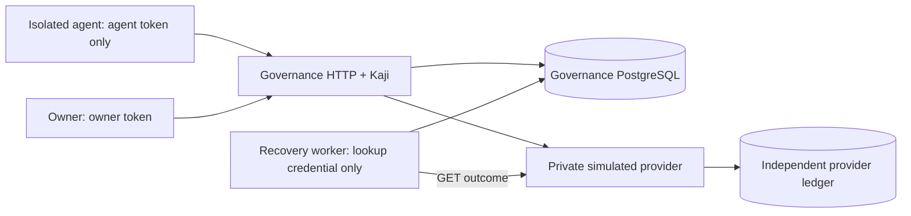

# Cankan: simulated agent action governance

Stages 0–3: authenticated action intake, governed simulated execution, and durable reconciliation of uncertain payment outcomes. No real payments, emails, Jev calls, MCP, dashboard, approval workflow, or assessment service.

The agent submits `payments.purchase` with a task, quote, and stable operation ID. Trusted code resolves immutable quotes from a private simulator, saves canonical inputs, and uses Kaji to dispatch permitted purchases. Currency is **SIM_CENTS**, with no monetary value. A purchase including fees costs at most **500**; all authorized agents share each task's **2,000** limit. Reservations include completed payments and unresolved attempts.



## Setup and demo

Requires Node >=20.20.1, npm, and Docker Compose. These commands are for a fresh local simulator; `.secrets/` and database volumes persist across runs.

```sh
npm ci
npm run build
node dist/scripts/setup-secrets.js
docker compose up -d --wait db provider-db
docker compose run --rm --build setup
docker compose up -d --build --wait provider api worker
docker compose run --rm --build agent
npm run verify:boundary
```

The agent command submits a simulated purchase. `verify:boundary` discovers current container IPv4 and any enabled IPv6 addresses, requires healthy private services and trusted reachability, then probes every private address and service name from the actual agent container. An authenticated API validation request is the positive control and consumes no budget. The probe also checks secrets, trusted source, Docker socket absence, non-root execution, read-only filesystem, capabilities, and no-new-privileges. It exits nonzero on broken controls or forbidden reachability. Run it again after recreating containers. Set `COMPOSE_PROJECT_NAME` when using a named test project.

The agent image contains only its client and boundary probe. Services have no source mounts; only the API has a host port, bound to loopback through an API-only host network. Never give the untrusted agent a shell on the host running these services: the Compose container is the intended execution boundary. The developer workspace is trusted.

Host demo (same agent identity, new operation ID):

```sh
AGENT_A_TOKEN_FILE=.secrets/agent-a-token npm run demo
```

With the worker running, demonstrate a committed charge whose response is lost:

```sh
AGENT_A_TOKEN_FILE=.secrets/agent-a-token npm run demo:recovery
```

It first reports `unresolved` / Kaji `unknown`, then waits up to 30 seconds for application `succeeded` while Kaji remains `unknown`. It consumes 500 SIM_CENTS of the existing fixture task budget. In PowerShell, set `$env:AGENT_A_TOKEN_FILE='.secrets/agent-a-token'` and run `npm.cmd run demo:recovery`.

## Upgrade and reconciliation commands

For an existing installation, stop `api` and any `worker`, rebuild locally, rerun secret setup (adds only the new `provider-lookup-token`), then use the same Compose project and volumes:

```sh
docker compose stop api worker
npm run build
node dist/scripts/setup-secrets.js
docker compose up -d --wait db provider-db
docker compose run --rm --build setup
docker compose up -d --build --wait provider api worker
npm run verify:boundary
```

`governance-003.sql` adds attempt versions, recovery jobs, and immutable observations. It backfills old attempts and installs an enqueue trigger inside the migration transaction. Existing quotes, identities, reservations, receipts, secrets, and volumes remain intact; setup and migrations are repeatable. The provider lookup reads the existing immutable ledger, so its schema needs no migration.

One bounded pass (up to four due jobs):

```sh
docker compose run --rm --no-deps worker node dist/src/worker-main.js --once
```

For host processes, `npm run reconcile` runs one pass; `npm run worker` repeats passes. Both require `DATABASE_URL`, `PROVIDER_URL`, and `PROVIDER_LOOKUP_TOKEN` (or their `_FILE` forms). The worker does not need the payment credential. Start the provider with both `PROVIDER_TOKEN` and `PROVIDER_LOOKUP_TOKEN`; they must differ.

New jobs become due after five seconds. Each worker handles at most four lookups concurrently, with a 2.5-second HTTP timeout, 15-second database lease, and retry delays of 5, 10, 20, 40, 80, 160, then 300 seconds. Eight claimed lookup attempts is the ceiling, including a claim whose worker crashes before sending its GET. Exhaustion requires operator attention and retains the unresolved budget obligation. There are no charge retries, cancellation, terminal no-effect outcomes, or automatic budget releases.

Authenticated operation status includes `reconciliation.status`, `lastCheck`, `nextCheck`, `lookupCount`, fixed `lastError` codes, and accepted receipt evidence. Owners keep organization-scoped visibility; agents keep their original operation visibility. Detailed observations remain in the operator-only database. Pause/revocation prevents new dispatch authorization but does not stop investigation of already-authorized effects.

The fixture task has four 500-cent purchases of capacity across **both** A agents. Later demo operations are denied when that budget is consumed. Both demos exit nonzero unless the purchase succeeds. Repeated fixture setup does not reset budgets, revoke controls, tokens, or existing quote expiries. Do not remove volumes unless intentionally discarding all simulator data.

Pause/resume with the owner token from a trusted terminal:

```sh
curl http://127.0.0.1:3000/owner/pause \
  -H "Authorization: Bearer $(cat .secrets/owner-a-token)" \
  -H 'Content-Type: application/json' -d '{"paused":true}'
```

Use `{"paused":false}` to resume. `/owner/revoke` accepts `{"principalId":"<agent UUID>"}` and permanently disables that credential for this increment. Owner credentials cannot submit purchases; agent credentials cannot change controls. Authenticated GET `/operations/<operationId>` returns the saved input, decision, dispatch, attempt, actual provider receipt if known, and separate Kaji outcome. Agents read their own operations; owners read their organization's operations. Other organizations receive 404.

Accepted purchase input (all additional fields, including claimed identities/prices, are rejected):

```json
{
  "operationId": "purchase-001",
  "action": "payments.purchase",
  "taskId": "aaaaaaaa-1111-4111-8111-111111111111",
  "quoteId": "quote-normal"
}
```

Fixtures include two organizations, A agents `aaaaaaaa-aaaa-4aaa-8aaa-aaaaaaaaaaa1` and `...aaa2`, one B agent, and separate owners. `quote-normal` is 500 + 0 fees; `quote-fees` is 450 + 50. Other quotes exercise excess fees, disallowed seller/currency, expiry, organization isolation, and a lost response after a committed provider charge. Fixture quotes expire 30 days after initial seeding. Tokens are random, stored only as SHA-256 hashes in the governance database; raw fixture tokens are operator-owned files.

## Tests

Use a disposable, real PostgreSQL administrator database named `cankan_test` on loopback. Tests create uniquely named databases and drop only those they create. They refuse missing/unsafe test configuration; no mock-database fallback or silent skip.

```sh
# Optional local PostgreSQL test server, separate from the private demo databases:
docker run --rm --name cankan-test-postgres \
  -e POSTGRES_HOST_AUTH_METHOD=trust -e POSTGRES_DB=cankan_test \
  -p 127.0.0.1:55432:5432 postgres:16.14-bookworm

# Another terminal:
npm run typecheck
TEST_DATABASE_URL=postgres://postgres@127.0.0.1:55432/cankan_test npm test
npm run build
```

The TypeScript tests use `tsx` with native `node:test`. They launch two independent governance processes and compare decisions, reservations, attempts, and receipts with the simulator's independent PostgreSQL ledger. A connection-resilience test terminates only the PostgreSQL backend it just opened, then verifies reconnection. Script checks also cover demo exit codes and preserving credentials during setup. See [review evidence](docs/review.md) for actual results and unexecuted checks.

For existing local PostgreSQL databases, `DATABASE_URL` and `PROVIDER_DATABASE_URL` select separate databases. Run `npm run migrate`, supply the five `AGENT_A_TOKEN`, `AGENT_A2_TOKEN`, `AGENT_B_TOKEN`, `OWNER_A_TOKEN`, `OWNER_B_TOKEN` values (or corresponding `_FILE` paths), and run `npm run fixtures`. Start `npm run provider` with `PROVIDER_DATABASE_URL`, `PROVIDER_TOKEN`, `PROVIDER_LOOKUP_TOKEN`, then `npm start` with `DATABASE_URL`, `PROVIDER_URL`, `PROVIDER_TOKEN`. Start the worker as described above. Local entrypoints bind loopback by default. These host processes do not isolate arbitrary code running under the same host account.

## Dependencies

Exact direct versions are pinned in `package.json`; all transitive versions and integrity hashes are in `package-lock.json`.

| Dependency | Version | Purpose |
|---|---|---|
| `@irogane/kaji` | 0.3.1 | Embedded execution boundary |
| `pg` | 8.23.0 | PostgreSQL client |
| `zod` | 4.6.5 | Strict request, quote, saved-input, receipt schemas |
| `typescript` | 5.9.3 | Strict TypeScript compilation |
| `tsx` | 4.23.15 | TypeScript runner for native Node tests/scripts |
| `@types/node` | 20.19.43 | Node types |
| `@types/pg` | 8.23.1 | PostgreSQL client types |

Kaji's published [0.3.1 API](https://github.com/enkyuan/kaji/blob/v0.3.1/docs/api.md), [store interface](https://github.com/enkyuan/kaji/blob/v0.3.1/packages/ts/src/store/store.ts), npm README, installed `dist/index.d.mts`, and runtime source were inspected. Published 0.3.1 accepts a `.parse()` validator; current upstream documentation describes a later Standard Schema interface. This implementation typechecks against the installed package. Kaji supplies neither our authentication/policy nor a database, approval UI, or recovery engine. Its license is FSL-1.1-ALv2; see the installed package license.

See [transaction boundaries and crash gaps](docs/architecture.md) for the execution protocol and unresolved-state rules.
