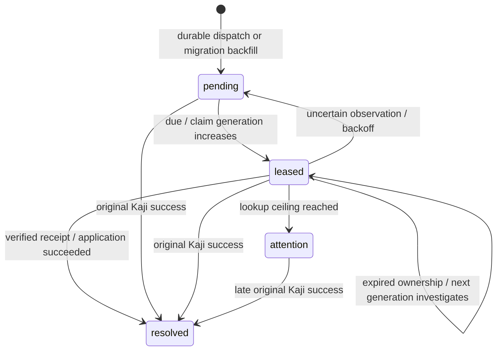

# Execution protocol and trust boundary

Agent authority comes exclusively from an authenticated bearer token matched to a stored, active principal. Organization and role come from that row. Each operation key is unique within the organization, across agents. The original agent owns its operation; a sibling agent cannot acquire another execution by reusing its key. Distinct operations share the task budget. Body schemas are strict, request bodies and headers are capped at 8 KiB, identifiers are bounded, and cents are integers between 0 and 1,000,000. Purchase policy then caps amount plus fees at 500.

The provider URL and credential are trusted deployment configuration, never supplied by the agent. Quotes have immutable seller, amount, fees, simulated currency, organization, and expiry. Only the provider database's trusted fixture loader can create them. The API confirms quote identity and organization, saves the complete quote inside immutable canonical input, and hashes sorted JSON with SHA-256. The immutable operation stores both the original validated selection and the execution input. Changed input under the same operation key returns 409 before Kaji/provider invocation.

The provider separately authenticates every route and owns its own database. Its ledger enforces one charge per provider operation UUID with a transaction advisory lock plus primary key. Identical requests replay the actual saved receipt, including after quote expiry; changed terms conflict. Provider operation IDs are generated once and saved before dispatch. No raw charge, credential, quote creation, or ledger route exists on the agent-facing service.

## Transactions

1. **Intake:** authenticate, validate, resolve quote outside a transaction, then atomically insert immutable application operation (organization/key uniqueness). Competing submissions load the winner and compare validated requests. No reservation or provider effect exists yet.
2. **Claim and dispatch:** the application-specific `PgExecutionStore.claim()` begins a short transaction. Lock organization, task, and principal; atomically insert the Kaji execution identity; then read PostgreSQL time and decide policy. The expiry clock is read after acquiring the locks, since a locking SELECT can evaluate its timestamp before waiting. A permitted decision updates reserved cents and creates a dispatch plus unresolved attempt in the same transaction. The attempt insert trigger also enqueues recovery work in this transaction. Denial or required approval creates a claim and decision only. Provider calls never occur inside this transaction.
3. **Kaji gates:** Kaji calls authorization against the saved decision. Assessment requirements deny. Approval requirements return Kaji `rejected` because no approver is installed. A permitted dispatch proceeds to the single static capability. It executes the saved canonical input and stable provider identity, never fresh request arguments.
4. **Provider:** its independent transaction locks the operation key, checks immutable quote/fingerprint/currency/expiry, and inserts the actual receipt. Both services use the same transaction helper for commit, rollback, client release, and a five-second lock timeout. The provider replies or drops its fault-fixture response only after that helper commits. HTTP occurs outside our transaction. The service verifies all execution-relevant receipt fields. Failed calls and invalid receipts remain uncertain; even a provider 4xx is conservatively unresolved in this increment.
5. **Final record:** `PgExecutionStore.record()` locks the attempt, recovery job, then execution identity. It atomically records the actual redacted Kaji outcome and, for consistent success, the receipt, attempt version, resolved job, and audit observation. Matching already-accepted receipts are harmless. A late non-success result never downgrades application success. Contradictory results are rejected and leave a protected audit observation without replacing accepted application evidence or prior Kaji history. No reservation changes occur.

The store implements exactly `claim(ExecutionClaim): Promise<ClaimResult>` and `record(StoredExecution): Promise<void>`. PostgreSQL claims are unique on capability/principal/idempotency key and operation ID. Kaji's own input fingerprint is a canonical JSON string, separate from the application's SHA-256 fingerprint. Existing claim waiters poll for at most two seconds; timeout rejects the wait, never reclaims the payment execution or invents a terminal result. The HTTP response reports durable application status. Worker leases transfer ownership of investigation only; no worker re-executes Kaji or submits a payment.

## Reconciliation protocol (Stage 3)

The private provider exposes `GET /organizations/<organizationId>/operations/<providerOperationId>` only to a separate lookup credential. The credential grants trusted worker access to this simulator account; the query additionally filters the charge through its immutable quote's organization. The payment credential cannot use lookup, and the lookup credential cannot fetch quotes or POST charges. No new payment identity is allocated. The response includes the actual saved receipt and immutable quote; older ledger entries work without modification.

The worker validates the saved canonical input's hash, response organization, full quote fingerprint (including organization and expiry), provider operation identity, quote binding, seller, amount, fees, total, and currency. A receipt remains valid evidence after the quote expires. Missing (including 404), malformed, mismatched, oversized, unavailable, or timed-out responses leave application state unresolved. Absence of evidence cannot prevent a delayed original charge and is never terminal failure.

1. **Claim:** select a due unresolved attempt/job with `FOR UPDATE ... SKIP LOCKED`. In a short PostgreSQL transaction, increment generation and lookup count and set a 15-second lease using database time. The counter counts claimed lookup attempts, including a crash before GET. New dispatches wait five seconds; migrated unresolved attempts are immediately eligible. Completed attempts are backfilled as resolved.
2. **Lookup:** release database locks before issuing GET. Per worker, at most four requests run concurrently. Requests and response-body reads have a 2.5-second timeout; responses are capped at 8 KiB. The worker has only its governance database access and lookup credential, never the provider payment secret.
3. **Save:** lock attempt then job. After all lock waits, verify the same generation, a still-unexpired lease against `clock_timestamp()`, unresolved application state, and the expected attempt version. A conditional job UPDATE rechecks the lease at the write boundary. Receipt, application success/version, job resolution, and immutable observation commit together. Any failure rolls them all back. Accepted success keeps the original reservation counted, without a second spending counter.
4. **Retry:** error/uncertainty writes use exactly the same fence. Backoff is 5, 10, 20, 40, 80, 160, then 300 seconds. At eight claimed attempts the job requires operator attention, with unresolved application state and budget held. A crash on the final lease is moved to attention after lease expiry without a ninth lookup. A bounded one-pass command processes at most four jobs; Compose's background worker repeats passes once per second after each batch. Operators inspect `reconciliation_jobs` and `reconciliation_observations`; there is no agent-accessible retry or reset endpoint.

An expired worker cannot save anything, even if nobody has replaced it. A stale generation, unexpected attempt version, or already-resolved job also rejects both success and error writes without adding an authoritative observation. Identical replay of the same save has no additional effect. Protected observations retain validated conflicting terms or a fingerprint of malformed content; status exposes fixed error codes and accepted evidence, never arbitrary error strings or credentials.

If recovery wins first, an eventual matching original success records Kaji history without charging, reserving, or changing the receipt again. An original timeout records Kaji `unknown` while application state remains `succeeded`. If original completion wins first, it resolves the job and advances the attempt version; the in-flight worker is fenced out. Recovery does not create or rewrite Kaji outcomes: an interrupted claimant can have application success with Kaji `null`. A first contradictory original success is retained as the actual Kaji report plus diagnostic evidence, while the previously accepted application receipt stays unchanged; a later different report never overwrites recorded Kaji history.

Cancellation, terminal no-effect outcomes, and automatic budget release are deferred. Time, exhaustion, pause, revocation, and lease expiry do not establish the absence of a charge.

## Pause and revocation cutoff

Owner pause and agent revocation lock the same organization row as the dispatch transaction. A control that commits first blocks a new dispatch. A dispatch that commits first is durably authorized and may reach the provider after a pause/revocation response. Pause does not cancel it or release budget. Authentication can race with revocation, so the dispatch transaction rechecks active principal status under its locks. Controls are audited.

`dispatch.recordedAt` is a database timestamp taken while inserting the record, **not the exact commit time**. Lock serialization and commit establish ordering; timestamps do not prove that ordering. This implementation serializes purchases per organization as a deliberate throughput limit. Narrow the lock only if measured load requires it while retaining the shared control ordering.

## Crash gaps

| Crash/lost acknowledgement | Durable evidence | Result and retry behavior |
|---|---|---|
| Before immutable operation insert | Nothing | Same submitted operation may start safely |
| After operation insert, before claim transaction | Saved inputs only | Authenticated status says unresolved; same operation may safely claim because no dispatch exists |
| During claim transaction before commit | Transaction rolls back | No claim/reservation/dispatch/attempt survives; same operation may safely claim |
| Claim commit acknowledged or acknowledgement lost; before Kaji gate/provider call | Claim, decision, reservation, dispatch, pre-call attempt | Unresolved and budget held; duplicate waits/reads only, even if no provider charge occurred |
| Provider call did not reach provider, or provider transaction rolled back | Same application dispatch | Unresolved and held; this increment cannot prove absence of an effect |
| Provider committed; response dropped or service died | Provider ledger has charge; application still unresolved; recovery job survives | Lookup confirms the saved receipt and application success; reservation stays counted; no new charge submission |
| Valid receipt received, before/during final store transaction | Provider receipt exists; application final transaction either commits or rolls back atomically | Success+receipt together, or unresolved+held; no new payment |
| Final store commit acknowledged or acknowledgement lost | May already have saved success+receipt | Status reads durable facts. Kaji may transiently return `unknown` on a lost store acknowledgement; HTTP does not overwrite saved success with that result |
| HTTP response lost after completion | Saved application result and provider ledger | Identical retry replays, changed input conflicts |

Application states (`succeeded`, `denied`, `blocked_approval`, `blocked_assessment`, `unresolved`) differ from Kaji statuses and recovery job states. In particular, `unresolved` includes a pending/dead claimant with no Kaji result and an explicit Kaji `unknown`. It never means proven failure. Status reads expose dispatch, attempt, accepted evidence, Kaji outcome, and recovery status/last check/next check/lookup count separately. This increment never releases reservations, including completed spend.

## Deployment boundaries and limits

Compose puts the agent on an internal network containing only the API. The API additionally joins its database network, a provider link, and an API-only host network for loopback port publishing. The worker joins the governance database and provider-link networks with only database and lookup secrets. The provider alone joins its ledger database network during normal operation; trusted fixture setup also joins it when explicitly run. Neither database nor the provider publishes a host port. The agent has only its own token, a read-only client/probe image, no source/host mounts, no container socket, no owner/admin/provider/database secrets, no capabilities, and no privilege escalation. Database volumes and simulator credentials persist.

`npm run verify:boundary` is a trusted host controller: it discovers current service addresses via Docker, checks health and positive TCP reachability from authorized trusted containers, and passes only names/IPs/ports to the real agent container. The agent probes every discovered IPv4 and enabled IPv6 address plus service names, verifies an authenticated API request, and checks its filesystem, secrets, capabilities, UID, and no-new-privileges. Missing/stopped services or a failed API positive control fail the command. Address discovery never gives the agent a Docker socket or privileged credentials.

The trusted operator owns the host and secret files. Administrative access to those databases or the container engine is outside the untrusted-agent boundary. The local bootstrap database accounts own their databases; database-role hardening, secret rotation and TLS termination are deployment follow-up, not supplied by Kaji. Do not expose this loopback demo API directly on the public internet. Process HTTP gates cap 240 requests/minute/IP and 128 concurrent connections, and a PostgreSQL counter caps authenticated principals at 120/minute across replicas. A distributed edge limiter would be needed for public unauthenticated traffic. Errors are fixed application messages/codes; authorization headers, exception causes, and connection strings are never emitted.

The simulator's `drop_after_commit` fixture is trusted database configuration; agents cannot select fault behavior in input. It creates a real durable simulated charge and closes the response, making conservative uncertainty testable. Only the test/operator process can inspect the provider ledger directly.
